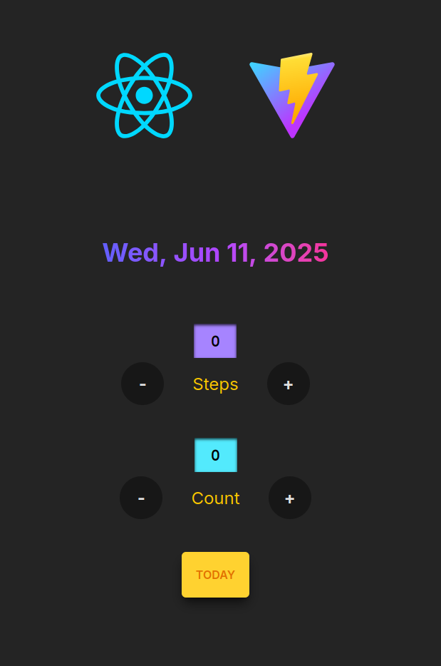

# 🧮 Date Counter App

This is a simple and visually appealing React application created using **Vite** and styled with **Tailwind CSS**. It features two interactive counters and a reset button, along with a dynamic date display.

---

## 🎯 Button Functions

### 🔢 `Steps` Counter
- ➕ **Plus Button**: Increments the **Steps** count by 1
- ➖ **Minus Button**: Decrements the **Steps** count by 1

### 🔢 `Count` Counter
- ➕ **Plus Button**: Increments the **Count** by 1
- ➖ **Minus Button**: Decrements the **Count** by 1

### 🟡 `TODAY` Button
- Resets both `Steps` and `Count` to **0**
- Optionally resets the date to **today’s date** (if you implemented date changes)

---

## 🧱 Tech Stack

- ⚛️ [React](https://reactjs.org/)
- ⚡ [Vite](https://vitejs.dev/)
- 🎨 [Tailwind CSS](https://tailwindcss.com/)

---

## 🖼️ Preview

  

---

## 🛠️ Setup Instructions

### 🔧 Install

```bash
# Clone the repository
git clone https://github.com/your-username/react-vite-counter.git
cd react-vite-counter

# Install dependencies
npm install
```

### 🚀 Run the App

```bash
npm run dev
```

Visit: `http://localhost:5173`

---
## 📄 License

This project is open-source and available under the [MIT License](LICENSE).

---

## 🙌 Acknowledgements

- React Logo from [reactjs.org](https://reactjs.org/)
- Vite Logo from [vitejs.dev](https://vitejs.dev/)
- Styling by [Tailwind CSS](https://tailwindcss.com/)
